# CPNA-AWS-CheatSheet
CheatSheet del contenido de la certificación CPNA - AWS
# Terraform
## Instalación Terraform Linux
```bash
wget https://releases.hashicorp.com/terraform/1.1.9/terraform_1.1.9_linux_amd64.zip
```
```bash
unzip terraform_1.1.9_linux_amd64.zip
```
```bash
mv terraform /usr/local/bin/
```
## Despliegue Terraform Linux

> [!Note]
> Todos nuestros laboratorios requieren un usuario administrador para poder desplegar los diferentes componentes
```bash
terraform init
```
```bash
terraform apply
```

# Comandos CLI AWS
## Autenticación con AWS CLI

```bash
aws configure
```
Introducir valores para los campos requeridos.
```bash
AWS Access Key ID
AWS Secret Access Key
Default region name
Default output format
```
<details>
  <summary>Ejemplo:</summary>

  <kbd>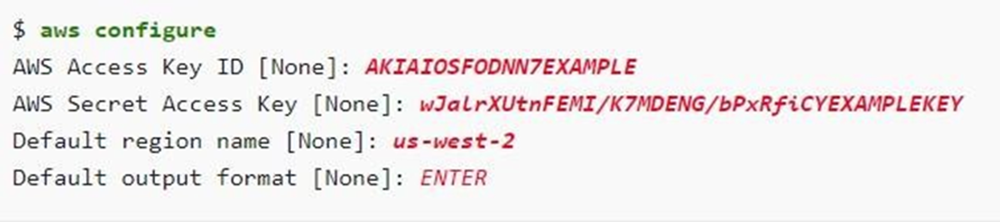</kbd>

</details>

## Creación de perfiles con nombre
### Opción 1 - AWS CLI
```bash
aws configure --profile
```
### Opción 2 - Modificando archivos de configuración
Modificar el archivo:
<table><tr><td>config</td></tr></table>

<details>
  <summary>Ejemplo:</summary>

  <kbd>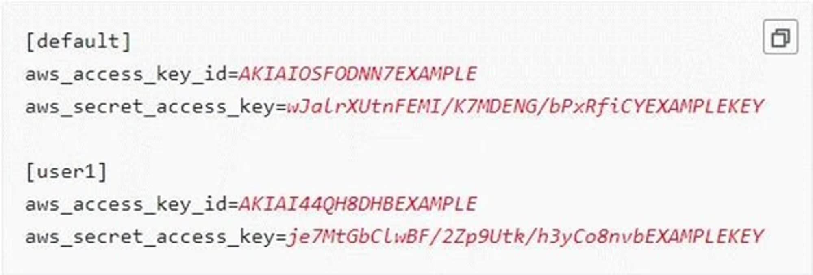</kbd>

</details>

## Estructura comandos AWS CLI
```bash
aws <comando o servicio> <Sub-Comando> [Opciones y parámetros]
```
<details>
  <summary>Ejemplo:</summary>

  <kbd>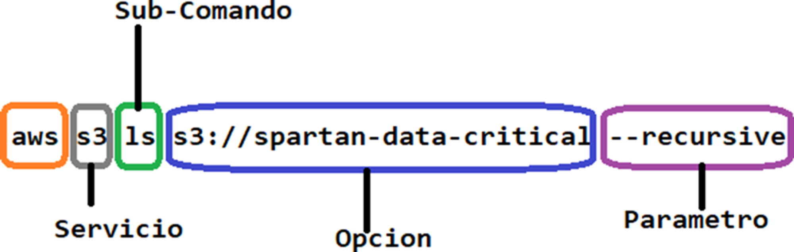</kbd>

</details>

## El whoami de AWS
### Opción 1
```bash
aws sts get-caller-identity
```
<details>
  <summary>Ejemplo:</summary>

  <kbd>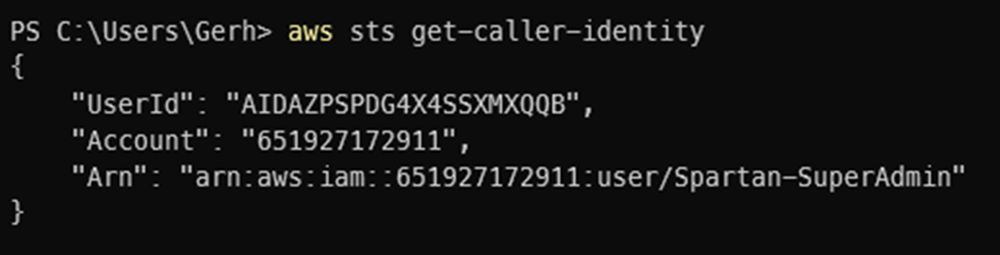</kbd>

</details>

### Opción 2 

> [!Note]
> Requiere privilegios <strong>iam:GetUser</strong>
```bash
aws iam get-user
```

<details>
  <summary>Ejemplo:</summary>

  <kbd>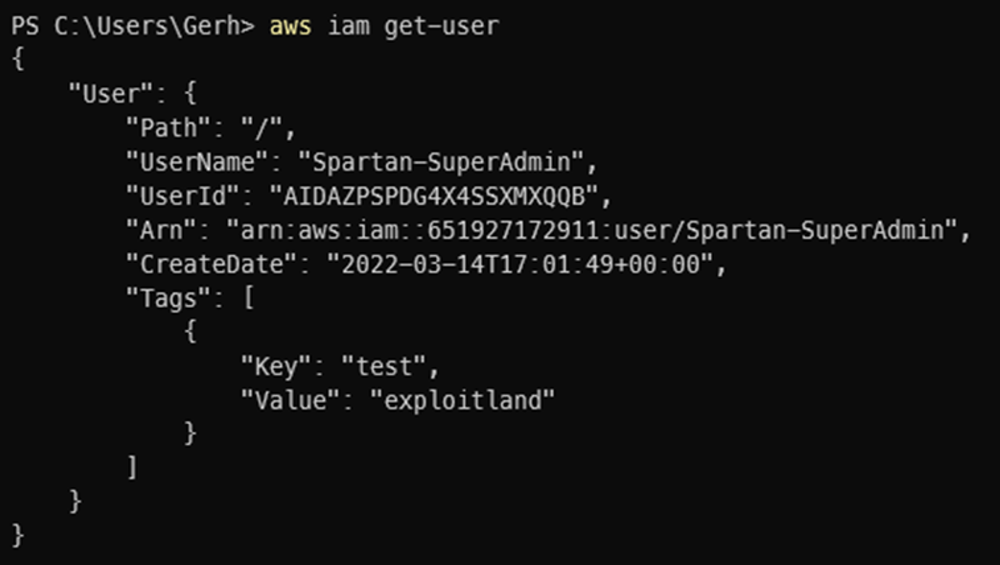</kbd>

</details>

# Enumeración manual de IAM
## Enumerando Usuarios
### Enumerando todos los usuarios exitentes en la cuenta AWS 
```bash
aws iam list-users
```
<details>
  <summary>Ejemplo:</summary>

  <kbd>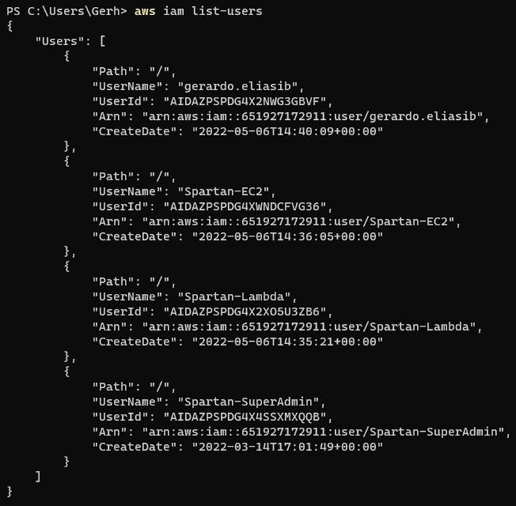</kbd>

</details>

### Enumerando todos los grupos a los que pertenece un usuario especifico 

```bash
aws iam list-groups-for-user --user-name Usuario
```
<details>
  <summary>Ejemplo:</summary>

  <kbd>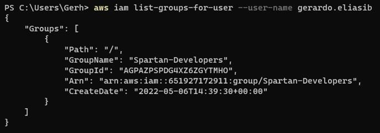</kbd>

</details>

### Enumerando información de las llaves públicas SSH de un usuario especifico
```bash
aws iam list-ssh-public-keys --user-name Usuario
```
<details>
  <summary>Ejemplo:</summary>

  <kbd>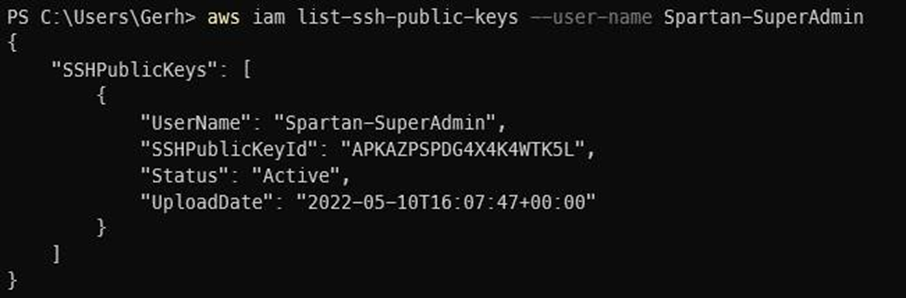</kbd>

</details>

```bash
aws iam get-ssh-public-key --user-name Usuario -- encoding PEM --ssh-public-key-id ID
```
<details>
  <summary>Ejemplo:</summary>

  <kbd>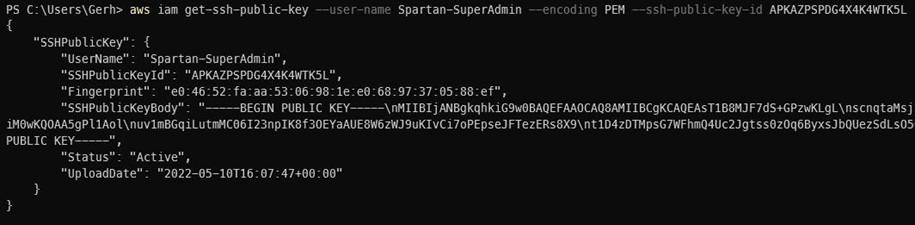</kbd>

</details>

### Enumerando certificados de firma asociados a un usuario especifico
```bash
aws iam list-signing-certificates --user-name Usuario
```
<details>
  <summary>Ejemplo:</summary>

  <kbd>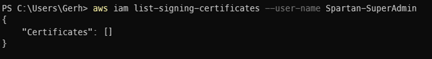</kbd>

</details>

### Enumerando dispositivos MFA virtuales de la cuenta de AWS

```bash
aws iam list-virtual-mfa-devices
```
<details>
  <summary>Ejemplo:</summary>

  <kbd>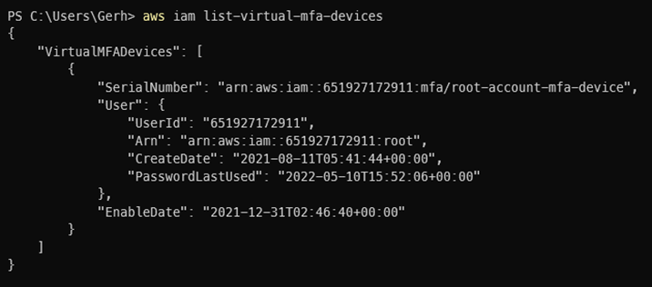</kbd>

</details>

### Enumerando políticas gestionadas adjuntas a un usuario especifico
```bash
aws iam list-attached-user-policies --user-name Usuario
```
<details>
  <summary>Ejemplo:</summary>

  <kbd>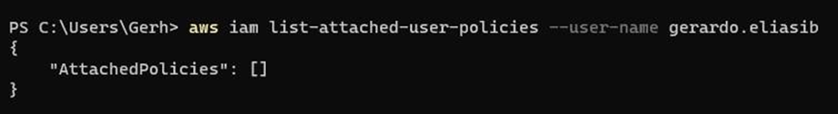</kbd>

</details>

### Enumerando políticas en linea incrustadas a un usuario especifico
```bash
aws iam list-user-policies --user-name Usuario
```
<details>
  <summary>Ejemplo:</summary>

  <kbd>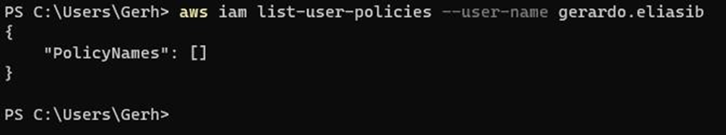</kbd>

</details>

## Enumerando Grupos
### Enumerando todos los grupos 
```bash
aws iam list-groups
```
<details>
  <summary>Ejemplo:</summary>

  <kbd>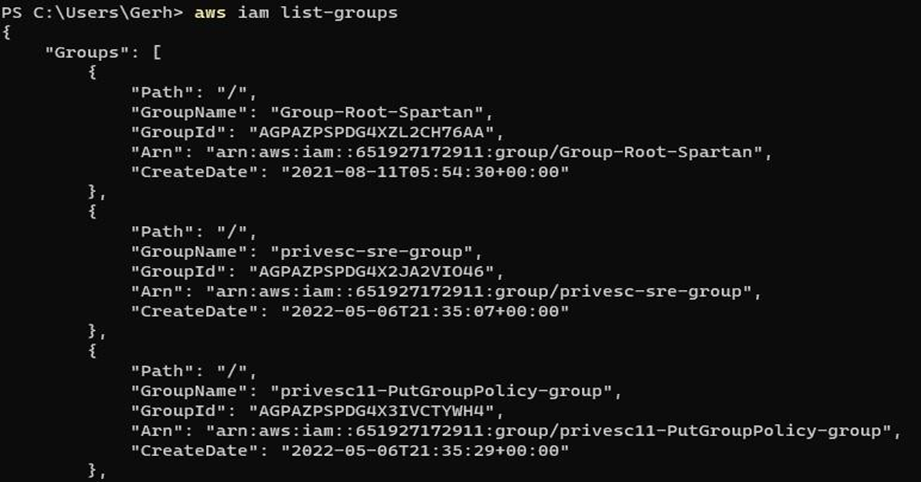</kbd>

</details>

### Enumerando políticas adjuntas a un grupo especifico
```bash
aws iam list-attached-group-policies --group-name Grupo
```
<details>
  <summary>Ejemplo:</summary>

  <kbd>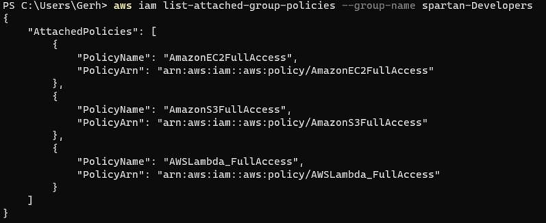</kbd>

</details>

### Enumerando nombres de las políticas en línea incrustadas a un grupo especifico
```bash
aws iam list-group-policies --group-name Grupo
```
<details>
  <summary>Ejemplo:</summary>

  <kbd>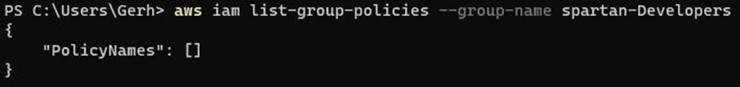</kbd>

</details>

## Enumerando Roles
### Enumerando todos los roles
```bash
aws iam list-roles
```
<details>
  <summary>Ejemplo:</summary>

  <kbd>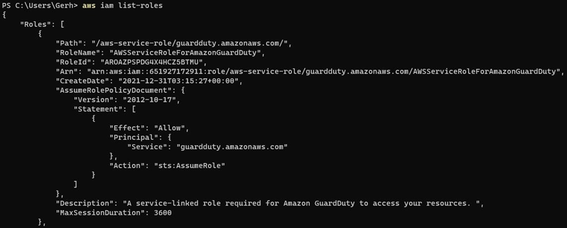</kbd>

</details>

### Enumerando todas las políticas gestionadas que se adjuntan a un rol especificado
```bash
aws iam list-attached-role-policies --role-name Rol
```
<details>
  <summary>Ejemplo:</summary>

  <kbd>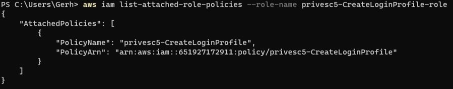</kbd>

</details>

### Enumerando los nombres de las políticas en línea incrustadas a un rol especifico
```bash
aws iam list-role-policies --role-name Rol
```
<details>
  <summary>Ejemplo:</summary>

  <kbd>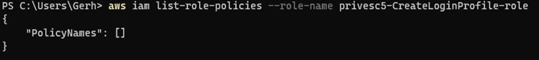</kbd>

</details>

### Enumerando información de un rol especifico
```bash
aws iam get-role --role-name Rol
```
<details>
  <summary>Ejemplo:</summary>

  <kbd>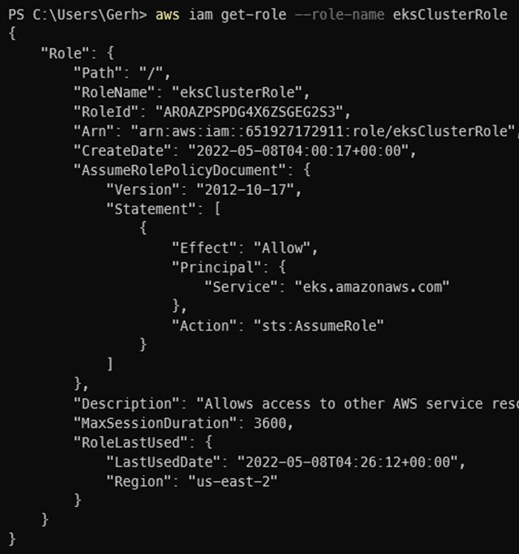</kbd>

</details>

## Enumerando Políticas
### Enumerando todas las políticas de IAM
```bash
aws iam list-policies
```
<details>
  <summary>Ejemplo:</summary>

  <kbd>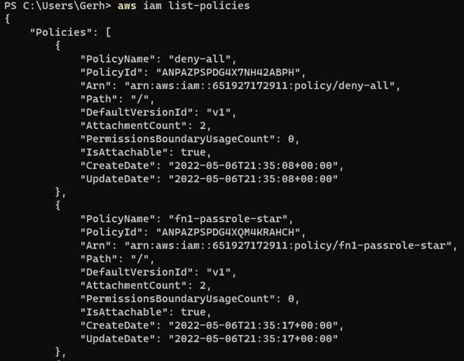</kbd>

</details>

### Enumerando información de una política especifica
```bash
>aws iam get-policy --policy-arn arn:aws:iam::123456789:policy/ejemplo
```
<details>
  <summary>Ejemplo:</summary>

  <kbd>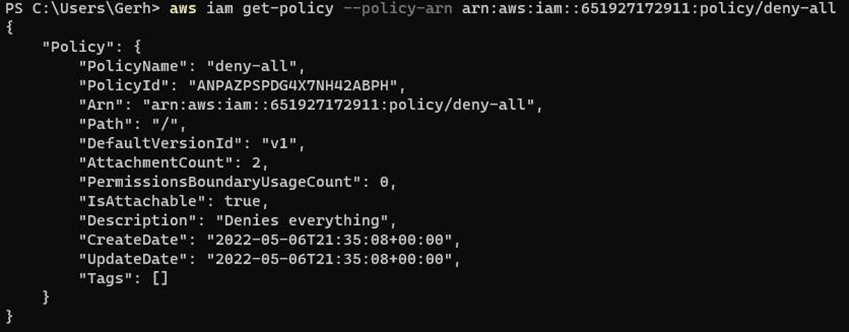</kbd>

</details>

### Enumerando información sobre las versiones de una política especifica
```bash
aws iam list-policy-versions --policy-arn arn:aws:iam::123456789:policy/ejemplo
```
<details>
  <summary>Ejemplo:</summary>

  <kbd>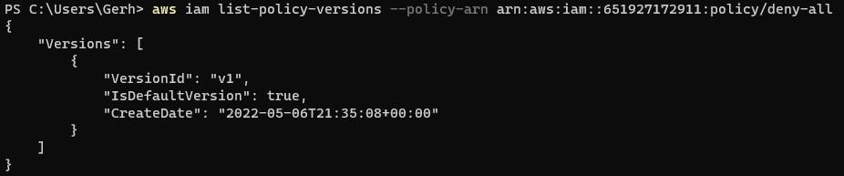</kbd>

</details>

### Enumerando información sobre una política especifica mediante la versión de la misma
```bash
aws iam get-policy-version --policy-arn arn:aws:iam::123456789:policy/ejemplo --version-id v1
```
<details>
  <summary>Ejemplo:</summary>

  <kbd></kbd>

</details>

# Enumeración Automatizada mediante fuerza bruta
> [!Note]
> Es una herramienta ruidosa generará una tonelada de registros de CloudTrail puede ser facil que el Blue Team se de cuenta de la enumeración.
> Es necesario evaluar si correr el riesgo con esta herramienta por lo ruidosa que es.
## Herramientas
### Enumerate-iam
https://github.com/andresriancho/enumerate-iam

### Instalación
```bash
git clone git@github.com:andresriancho/enumerate-iam.git
```
```bash
cd enumerate-iam/
```
```bash
pip install -r requirements.txt
```
### Enumerando
```bash

```
<details>
  <summary>Ejemplo:</summary>

  <kbd></kbd>

</details>

### Enumerando
```bash

```
<details>
  <summary>Ejemplo:</summary>

  <kbd></kbd>

</details>

### Enumerando
```bash

```
<details>
  <summary>Ejemplo:</summary>

  <kbd></kbd>

</details>

### Enumerando
```bash

```
<details>
  <summary>Ejemplo:</summary>

  <kbd></kbd>

</details>

### Enumerando
```bash

```
<details>
  <summary>Ejemplo:</summary>

  <kbd></kbd>

</details>

### Enumerando
```bash

```
<details>
  <summary>Ejemplo:</summary>

  <kbd></kbd>

</details>

### Enumerando
```bash

```
<details>
  <summary>Ejemplo:</summary>

  <kbd></kbd>

</details>

### Enumerando
```bash

```
<details>
  <summary>Ejemplo:</summary>

  <kbd></kbd>

</details>

### Enumerando
```bash

```
<details>
  <summary>Ejemplo:</summary>

  <kbd></kbd>

</details>

### Enumerando
```bash

```
<details>
  <summary>Ejemplo:</summary>

  <kbd></kbd>

</details>

### Enumerando
```bash

```
<details>
  <summary>Ejemplo:</summary>

  <kbd></kbd>

</details>

### Enumerando
```bash

```
<details>
  <summary>Ejemplo:</summary>

  <kbd></kbd>

</details>

### Enumerando
```bash

```
<details>
  <summary>Ejemplo:</summary>

  <kbd></kbd>

</details>

```bash

```
```bash

```
```bash

```
```bash

```
```bash

```
```bash

```
```bash

```
```bash

```
```bash

```
<details>
  <summary>Ejemplo:</summary>

  <kbd></kbd>

</details>

<details>
  <summary>Ejemplo:</summary>

  <kbd></kbd>

</details>

<details>
  <summary>Ejemplo:</summary>

  <kbd></kbd>

</details>

<details>
  <summary>Ejemplo:</summary>

  <kbd></kbd>

</details>

<details>
  <summary>Ejemplo:</summary>

  <kbd></kbd>

</details>
